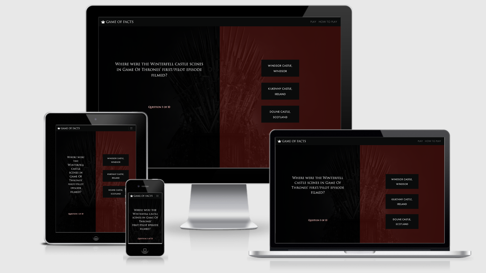
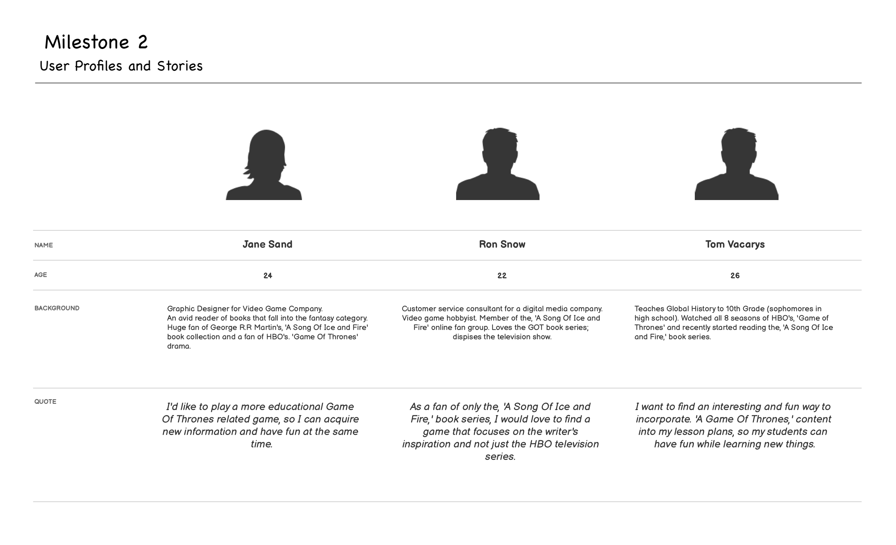
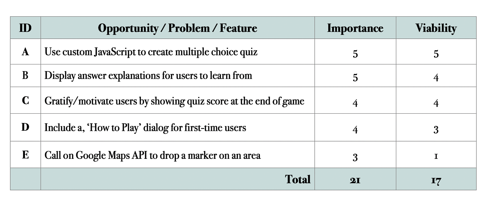
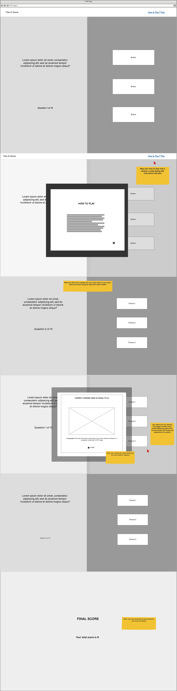
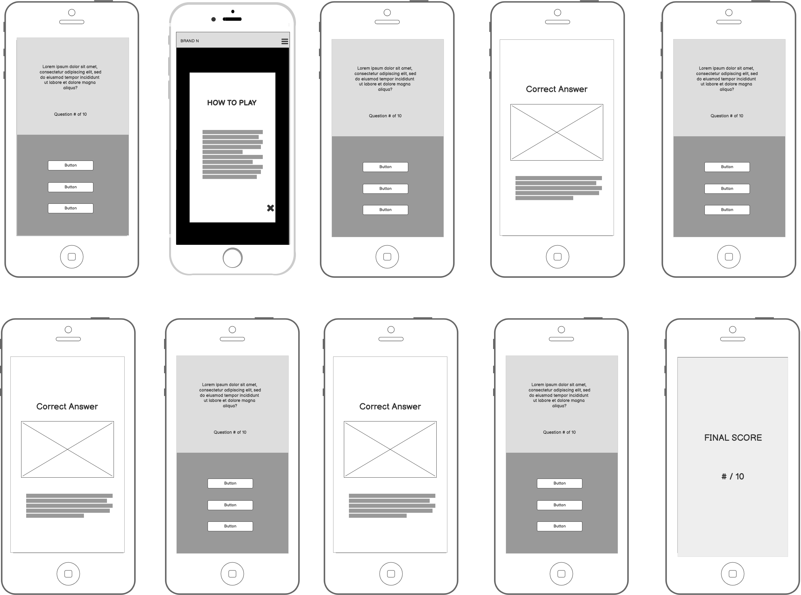
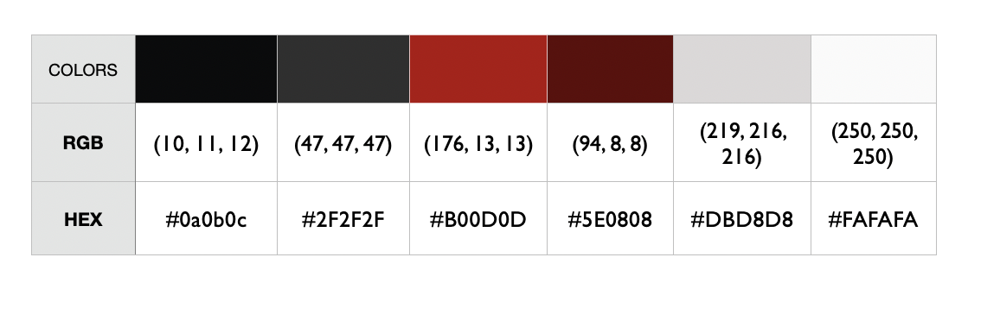

# Game Of Facts

As the Milestone 2 Project for [Code Institute's](https://codeinstitute.net/), 'Interactive Frontend Development' portion of the Full Stack Developer Program,  Game Of Facts is a web-based trivia game built for Game of Thrones fans and educators of global history. This project was built with HTML, CSS, Bootstrap 4, JavaScript, and jQuery to produce an educational and interactive experience.

## UX

The primary goals of, ' Game Of Facts' are:

* Create an interactive trivia game that is both informative and fun.

* Present historical/factual information in a fun and learnable way.

Game Of Facts' target market is comprised of:

* Men & women (ages 18-34) who enjoy history and are fans of the, 'A Song Of Ice and Fire' book series and/or the HBO hit TV series, 'Game Of Thrones'.

* Educators of world/global history that want to incorporate games and pop-culture into their lesson.

***NOTE: This game should not be played by anybody who has not finished the television or book series, as it may contain spoilers.***

A full write-up of the target market analysis can be viewed [here](wireframes/targetmarket.pdf)

User Stories were created during the development phase of this project to help the developer begin the wireframe process.

This document can be viewed [here](wireframes/userstories.jpg)

This Strategy Plane activity was conducted to determine which features were the most important and most viable.

The Trade-off Table exercise can be viewed in its' entirety [here](wireframes/strategy.pdf).

Once the strategy exercises were completed, the following wireframes were created by the [developer](https://www.github.com/alissatroiano) to guide the development process.

All wireframes were created with [Balsamiq](https://balsamiq.com/) wireframing software and can be viewed as a PDF document [here](wireframes/wireframes.pdf).

### Features

* **How To Play:** The 'How To Play' section allows users to read about the game before they get started by opening a modal with directions.

* **Quiz Questions:** The quiz section provides questions with multiple choices for users to read and answer by clicking on their best guess and triggering a modal to open.

* **Multiple Choices:** Displayed in the right-hand column, this feature allows the user to view the multiple-choice options and click on their desired choice so they can find out if they were right or wrong.

* **Progress:** The progress feature allows the user to see their progress in the game by displaying the number of the question they are currently working on out of the total number of questions in the game.

* **Final Score:** The final score section allows the user to see how many total questions they answered correctly, by displaying the score on the page at the end of the quiz.

#### Existing Features

* How To Play
* Quiz Questions
* Multiple Choices
* Progress
* Final Score

## UX Design

### Typography

The fonts selected for this project were:

1. Trajan-Pro-3, serif
2. Futura PT, sans-serif

The developer selected these fonts because:

* Trajan-Pro-3 is the font used for the official Game Of Thrones logo. It is widely recognized by Game Of Thrones fans and brings the right aesthetic to this web-based trivia game. This font was selected and used to style page titles, questions, progress, final score, and the game logo.

* Futura PT is a clean and modern sans-serif font that is recognizable and appealing to the project's target market. This font was chosen for answer explanations, multiple choices, navigation links, and other body text to compliment the Trajan-Pro-3, serif font.

## Color Palette

The following color palette was chosen by the [developer](https://github.com/alissatroiano) for this project:

## Technologies

* [HTML](https://html.com/)

* [CSS](https://www.w3.org/Style/CSS/Overview.en.html)

* [JavaScript](https://www.javascript.com/)

* [jQuery](https://jquery.com/)

* [Bootstrap](https://getbootstrap.com/)

* [GitHub/GitHub Pages](https://github.com/)

* [Git](https://git-scm.com/)

* [Gitpod](https://gitpod.io/)

* [JSHint](https://JSHint.com)

* [CSS Autoprefixer](https://autoprefixer.github.io)

* [W3C Jigsaw Validator](https://jigsaw.w3.org/css-validator/)

* [W3C HTML Validator](https://validator.w3.org/)

* [Popper.js](https://popper.js.org/)

* [Balsamiq](https://balsamiq.com/)

* [Jasmine](https://jasmine.github.io/)

## Testing

Defensive programming was implemented by the developer to ensure the game's speed and functionality. To read a full write-up of these tests, please refer to [TESTING](TESTING.MD).

## Deployment

This project was deployed with [GitHub Pages](https://pages.github.com/). The [developer](https://github.com/alissatroiano) deployed the project successfully by following these steps:

1. Created a repository on GitHub.
1. Exported the project to Gitpod.
1. Opened the project in Gitpod.
1. Created index.html.
1. Built project website.
1. Committed and pushed all changes to GitHub.
1. Imported project into GitHub Desktop and VSCode to work on Animations_Branch and experiment with new features.
1. Committed and pushed all changes to GitHub.
1. Merged Animations_Branch into master.
1. Deleted alternate branches.
1. Once the project was completed, I visited "repository settings" on GitHub.com.
1. Scrolled down to the GitHub Pages section and clicked, "source".
1. Selected the 'master' branch for deployment.
1. Fired up a browser and went [here](https://alissatroiano.github.io/Milestone-2/) to ensure deployment was successful.

### To run this project locally

1. Follow [this link](https://github.com/alissatroiano/Milestone-2) to the project's GitHub Repository.
2. In the 'Code' section to the project name and description.
3. Click the green button labeled, 'Clone or download.'
4. Copy the provided URL.
5. Open Git Bash in your local Integrated Development Environment.
6. Type the command, `git clone`.
7. Paste [this URL](https://github.com/alissatroiano/Milestone-2.git) that was copied from GitHub earlier.

**Another Option:**

1. Follow [this link](https://github.com/alissatroiano/Milestone-2) to the project's GitHub Repository.
2. In the 'Code' section scroll passed the project's name and description.
3. Click the green button labeled, 'Clone or download.'
4. Click, 'Download Zip'.
5. Wait for the zip file to extract.
6. Open the folder.
7. Open index.html in your web browser

### To run this project remotely

1. Open your local IDE
2. Type the command `git remote add origin` followed by [this URL](https://github.com/alissatroiano/Milestone-2).
3. Run ***git remote -v***
4. **cd** project folder

You can also:

* View a live version of this project [here](https://alissatroiano.github.io/Milestone-2)

## Credits

### Content and Research

* The target market research and demographic data used to create User Stories, Wireframes, and to pitch this project in README.md were obtained from [Wired.com](https://www.wired.com/2013/06/women-game-of-thrones/), [BusinessInsider.com](https://www.businessinsider.com/game-of-thrones-compared-to-most-popular-tv-shows-of-2018-ratings-2019-4?op=1#2-the-big-bang-theory-cbs-9), [WinterIsComing.net](https://winteriscoming.net/2017/01/16/results-song-of-ice-and-fire-game-of-thrones-demographic-survey/) and [Statista.com](https://www.statista.com/search/?q=A+Game+of+Thrones&qKat=newSearchFilter&sortMethod=idrelevance&isRegionPref=840&sortMethodMobile=idrelevance&statistics=1&dossiers=1&groupA=1&xmo=1&surveys=1&toplists=1&accuracy=and&region%5B%5D=3&isoregion=3&isocountrySearch=&category=0&interval=0&archive=1).

* The information about real historical events that inspired Game Of Thrones from the quiz portion of this project was copied from:

    1. [BBC.com](https://www.bbc.co.uk/programmes/articles/4RVybvDdJMq7fjRp5450yX1/the-real-historical-events-that-inspired-game-of-thrones) - to research real events that inspired Game of Thrones.
    2. [History Behind Game Of Thrones](http://history-behind-game-of-thrones.com) - to research the real history behind Game of Thrones.
    3. [LiveScience.com](https://www.livescience.com/59954-photos-game-of-thrones-set-locations.html) - for quiz content about Game Of Thrones filming locations
    4. [The Week](https://theweek.com/articles/463588/fromreallife-events-that-inspired-game-thrones-red-wedding) was used to obtain information about Scotland's historical Black Dinner of 1440.
    5. [Ancient.eu](https://www.ancient.eu/Battle_of_Bosworth/) and [Brittanica.com](https://www.britannica.com/event/Wars-of-the-Roses) were referenced to obtain historical information about The War Of The Roses.
    6. [Fandom](https://gameofthrones.fandom.com/wiki/Ironborn) - the quiz answer about the Ironborn and Vikings was copied and pasted from this article.

### Code

* The functions used to create the quiz for this project were copied from/learned by following the, 'How to Create JS Quiz App,' tutorial on [Webdevtrick.com](https://webdevtrick.com/create-javascript-quiz-program/) and adjusted by the developer.

* The modal dialog box used to display the correct question answers, GIF images, and descriptions was copied from [Bootstrap](https://getbootstrap.com/docs/4.5/components/modal/).

* The modal dialog box used to display the directions for the game was copied from [Bootstrap](https://getbootstrap.com/docs/4.5/components/modal/).

* The branded navbar with toggle expand was copied from [Bootstrap](https://getbootstrap.com/docs/4.5/components/navbar/).

* The GIF images used in each modal dialog box were copied from [GIPHY](https://giphy.com/).

* The media queries in the stylesheet were copied/learned from [w3schools.com](https://www.w3schools.com/css/css_rwd_mediaqueries.asp)

* Line 2 of question.js, which enables `jQuery.noConflict())` mode was copied from [jQuery.com](https://api.jquery.com/jQuery.noConflict/)

* The classes used to style the game's grid and buttons were also copied from [Bootstrap](https://getbootstrap.com).

* The solution code for removing the blue outline from `.navbar-toggler` was copied from [Stack Overflow](https://stackoverflow.com/questions/23333231/bootstrap-button-shows-blue-outline-when-clicked) and applied to the [stylesheet](assets/css/style.css).

* The JavaScript used to make the navbar toggler close automatically after a link is clinked was copied from [Stack Overflow](https://stackoverflow.com/questions/42401606/how-to-hide-collapsible-bootstrap-4-navbar-on-click).

* The styles used to prevent the background from being scrolled while modal is open were copied from [CSS Tricks](https://css-tricks.com/prevent-page-scrolling-when-a-modal-is-open/).

### Media

* The background image of the iron throne used in the jumbotron section was downloaded/licensed via [Shutterstock](https://www.shutterstock.com/image-illustration/medieval-iron-throne-kings-made-weapons-1403501564).

### Acknowledgements

* The JavaScript and jQuery techniques used to build this project were learned during the 'Interactive Frontend Development' portion of [Code Institute's](https://codeinstitute.net/) Full-Stack Software Developer Program.

* [Quackit.com](https://www.quackit.com) for providing this informative article titled, ['HTML audio tag'](https://www.quackit.com/html/tags/html_audio_tag.cfm).

* The markdown used to create this README.md document was learned from [commonmark.org](https://commonmark.org).

* Acknowledgments go to [MDN Web Doc](https://developer.mozilla.org/en-US/docs/Web/JavaScript/Inheritance_and_the_prototype_chain) for providing learnable information about inheritance and the **prototype** chain, which were used to help me gain a more thorough understanding of prototyping in JavaScript.

* The article, 'Mastering Markdown' by [GitHub Guides](https://guides.github.com/features/mastering-markdown/) for providing a useful markdown syntax guide.

* [Code Institute's](https://codeinstitute.net/) [README Template](https://github.com/Code-Institute-Solutions/readme-template) was used as a guide and foundation for this README document.
